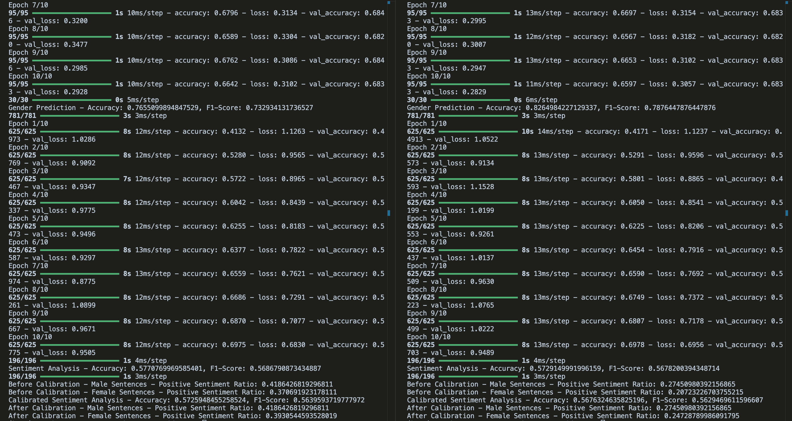

# Gender Bias Detection and Debiasing in Sentiment Analysis

My report can be found in Max_Cheever___CMPSC_497_Midterm_Project.pdf.

How to run the code:

To use this project, just make sure that all dependencies are correctly installed. Once you have this, you can run the code using `python bias2.py`. your output should look something like this:

